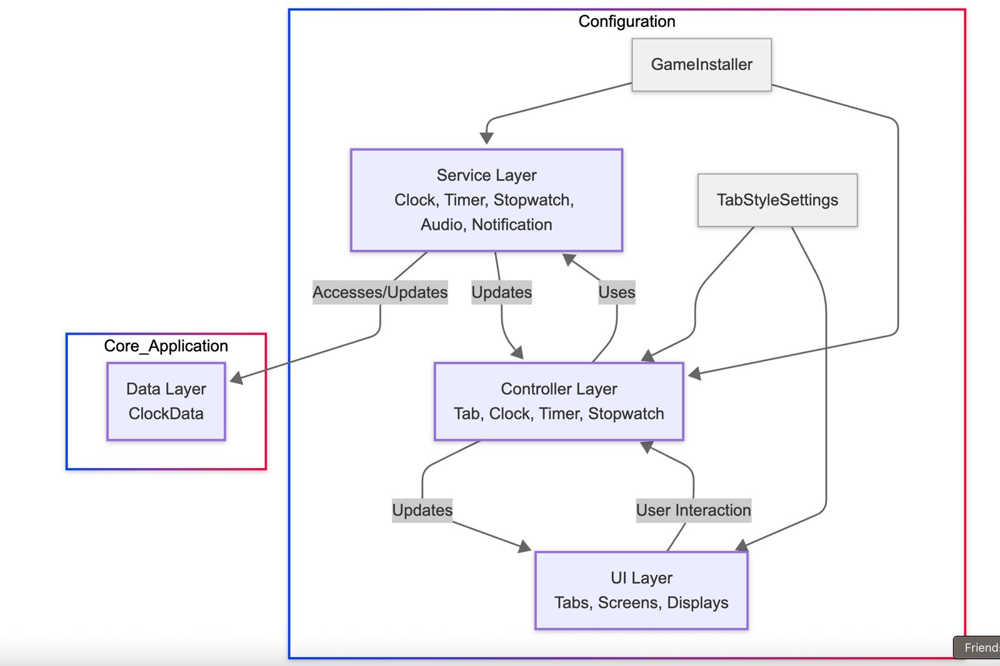

# Clock Application - Technical Documentation & Answers

Please find the Windows build under "windows-builder" folder in root folder.

## Answers

### As we said, this application will be used on iOS/iPad devices. Do you have any concern for UI?

Honestly, I have just one real worry: we need the app to run in portrait on iPads and iPhones, but right now it’s locked to landscape. The good news is that every panel and button already uses Unity’s anchor presets and layout groups, so as soon as we flip the Canvas to portrait it’ll rearrange itself correctly. So all we have to do is play around with the text scale responsiveness.

### How would you refactor the code and/or project after release? What would you prioritize as “must happen” versus “nice to have” changes

#### Must-Have Changes

Add a “World Clock” view where users pick cities from a searchable list; show each zone’s current time side-by-side.

Build a flexible alarm manager with repeat patterns and custom chimes that hooks into iOS notifications—basically matching iOS Clock’s feature set.

#### Nice-to-Have Enhancements

Swap color palettes or skins so the app is customizable.

Add dark/light mode.

Bounce buttons, fade timers, haptic taps—little flourishes to make interactions feel snappy.

Give users a picker to choose built-in ringtones or import their own.

### This application will be used on VR application. Share your concern and your opinion on what need to take into account to support it in VR?

For VR, we put the clock UI on a World-Space Canvas so it shows up in the 3D world. We place it at a comfortable distance (about 3 meters) and keep it within a small angle in front of the user so they don’t have to strain their neck. To keep the app running smoothly, we split fixed parts (like the clock face) and moving parts (like buttons) into separate canvases.

## Architecture Overview

The clock application follows a clean architecture pattern with clear separation of concerns, leveraging reactive programming and dependency injection throughout. This document outlines the technical implementation details, script relationships, and architectural patterns to help developers understand and contribute to the codebase.

## Architectural Diagram



## Testing Strategy

The application's architecture is designed to be highly testable, with all dependencies explicitly defined and injectable. Usually Edit mode tests are for testing logic and methods, restricted for the service scripts.

### Edit Mode Tests

Edit mode tests focus on testing individual components in isolation:

```csharp
[TestFixture]
public class TimerServiceTests
{
    private ITimeSystem _mockTimeSystem;
    private IAudioSystem _mockAudioSystem;
    private IPersistenceSystem _mockPersistenceSystem;
    private TimerService _timerService;

    [SetUp]
    public void SetUp()
    {
        _mockTimeSystem = Substitute.For<ITimeSystem>();
        _mockAudioSystem = Substitute.For<IAudioSystem>();
        _mockPersistenceSystem = Substitute.For<IPersistenceSystem>();

        _timerService = new TimerService(
            _mockTimeSystem,
            _mockAudioSystem,
            _mockPersistenceSystem);
    }

    [Test]
    public void Start_SetsIsRunningToTrue()
    {
        // Arrange
        bool isRunningValue = false;
        _timerService.IsRunning.Subscribe(value => isRunningValue = value);

        // Act
        _timerService.Start();

        // Assert
        Assert.IsTrue(isRunningValue);
    }

    // More tests...
}
```

### Play Mode Tests

Play mode tests focus on integration testing and UI interactions. it is more end to end testing and they are a bit harder to setup, as they require setting up the context and the UI elements and then mimicking user presses and actions.

```csharp
public class TimerViewTests : IPrebuildSetup
{
    private TimerView _timerView;
    private Button _startButton;
    private Button _resetButton;
    private Text _timeText;

    public void Setup()
    {
        // Load test scene
        SceneManager.LoadScene("TestScene");
    }

    [SetUp]
    public void SetUp()
    {
        _timerView = GameObject.FindObjectOfType<TimerView>();
        _startButton = _timerView.transform.Find("StartButton").GetComponent<Button>();
        _resetButton = _timerView.transform.Find("ResetButton").GetComponent<Button>();
        _timeText = _timerView.transform.Find("TimeText").GetComponent<Text>();
    }

    [UnityTest]
    public IEnumerator ClickingStartButton_StartsTimer()
    {
        // Arrange
        string initialText = _timeText.text;

        // Act
        _startButton.onClick.Invoke();
        yield return new WaitForSeconds(1.1f);

        // Assert
        Assert.AreNotEqual(initialText, _timeText.text);
    }

    // More tests...
}
```

## Project Folder Structure and Scripts Organization

The application's codebase is organized into a clear folder structure that reflects the architectural layers:

### Assets/Scripts/ Structure

```
Assets/Scripts/
├── Controllers/            # Application layer controllers
├── Data/                   # Data models and DTOs
├── Installer/              # Dependency injection setup
├── Services/               # Domain layer services
│   ├── Interfaces/         # Service contracts
│   └── Implementations/    # Concrete service implementations
├── Settings/               # Configuration and settings classes
├── Tests/                  # Unit and integration tests
└── UI/                     # UI components and view scripts
```

This organization makes it easy to navigate the codebase and understand the responsibilities of each component.

## Key Components Deep Dive

### Dependency Injection with Zenject

The project uses Zenject (a Unity-specific implementation of Extenject) for dependency injection. The main installer is defined in `GameInstaller.cs`:

```csharp
public class GameInstaller : MonoInstaller
{
    [Header("UI Settings")]
    [SerializeField] private TabStyleSettings _tabStyleSettings;

    [Header("Notification Settings")]
    [SerializeField] private AudioClip _timerCompletionSound;

    public override void InstallBindings()
    {
        // Services
        Container.BindInterfacesAndSelfTo<ClockService>().AsSingle();
        Container.BindInterfacesAndSelfTo<TimerService>().AsSingle();
        Container.BindInterfacesAndSelfTo<StopwatchService>().AsSingle();
        Container.Bind<TabStyleSettings>().FromInstance(_tabStyleSettings).AsSingle();
        Container.Bind<TabController>().FromComponentInHierarchy().AsSingle();
        Container.BindInterfacesAndSelfTo<AudioService>().AsSingle().NonLazy();

        Container.Bind<AudioClip>().WithId("TimerCompletionSound")
            .FromInstance(_timerCompletionSound).AsSingle();

        // Always active components
        Container.BindInterfacesAndSelfTo<NotificationManager>().FromNewComponentOnNewGameObject()
            .WithGameObjectName("Global_NotificationManager")
            .AsSingle()
            .NonLazy();

        // Execution order configuration
        Container.BindExecutionOrder<NotificationManager>(-10000);
    }
}
```

The installer binds all services and controllers to the dependency injection container, ensuring proper instantiation and lifecycle management.

### Navigation with TabController

The `TabController` implements a tab-based navigation pattern that allows switching between different features of the application:

```csharp
public class TabController : MonoBehaviour
{
    // Injected dependencies
    [Inject] private TabStyleSettings _styleSettings;
    [Inject] private DiContainer _container;

    // Tab configuration
    [SerializeField] private GameObject _tabElementPrefab;
    [SerializeField] private Transform _tabContainer;
    [SerializeField] private Transform _screenContainer;
    [SerializeField] private List<ScreenPrefabMapping> _screenMappings;

    // Reactive state
    private readonly ReactiveProperty<TabMode> _currentMode = new ReactiveProperty<TabMode>(TabMode.Clock);
    public IReadOnlyReactiveProperty<TabMode> CurrentMode => _currentMode;

    private GameObject _currentScreenInstance;

    // Implementation details...
}
```

### Controllers Layer

Controllers act as intermediaries between the UI and services:

1. **ClockController**: Manages the clock display and time zone selection UI.
2. **TimerController**: Handles timer UI interactions, including start/stop/reset functionality and timer presets.
3. **StopwatchController**: Controls the stopwatch UI, including lap time recording and display.

### Service Layer Implementation

The service layer contains the core business logic of the application:

1. **ClockService**: Fetches time data from network APIs (worldtimeapi.org) with fallback to system time.
2. **TimerService**: Implements countdown timer functionality with multiple timer support.
3. **StopwatchService**: Handles time tracking and lap recording.
4. **AudioService**: Manages sound effects and notifications.
5. **NotificationManager**: Handles system notifications when timers complete.

### UI Components

The UI layer consists of reusable components:

1. **TabElement**: Represents a clickable tab in the navigation bar.
2. **PersistentClockDisplay**: Shows the current time even when using other features.

### Data Models

The application uses lightweight data classes to represent domain objects:

```csharp
// ClockData.cs example
public class ClockData
{
    public DateTime CurrentTime { get; }
    public string TimeZoneId { get; }
    public string UtcOffset { get; }
    public bool IsServerTime { get; }

    public ClockData(DateTime currentTime, string timeZoneId, string utcOffset, bool isServerTime)
    {
        CurrentTime = currentTime;
        TimeZoneId = timeZoneId;
        UtcOffset = utcOffset;
        IsServerTime = isServerTime;
    }

    public static ClockData CreateSystemTimeData()
    {
        return new ClockData(
            DateTime.Now,
            TimeZoneInfo.Local.Id,
            TimeZoneInfo.Local.BaseUtcOffset.ToString(),
            false
        );
    }
}
```

### Dependency Injection

Zenject provides a comprehensive DI framework that:

- Decouples component creation from usage
- Manages object lifecycles (singleton, transient)
- Supports constructor injection and field injection
- Enables easier testing through dependency mocking

### Scene Setup

Most technologies have the same approach to creating scalable and repsonsive UI'. It all comes down to properly creating containers and layout groups. understanding these concepts can help you build reponsive UI.

Here is the scene setup:

```
Clock Main Scene
├── Main Camera
├── Scene Context
├── Event System
├── Canvas
│   ├── Background
│   └── Viewport  # The container that holds all the UI. (vert layout)
│       ├── Navigation Panel   # First container is the tab navbar on top (horizontal layout)
│       └── Details Panel      # Right under it is the details panel (horizontal layout) that contains clock that moves across screens
│           ├── Persistent Clock (Prefab)
        └── Screens  # The last container that will have the screens under it.
            ├── (ClockScreen/TimerScreen/StopwatchScreen) # Based on the selected tab load the appropriate screen.
├── Controllers
│   ├── Tab Controller # Implementation of the navbar controller where the screen mappings are setup
```
